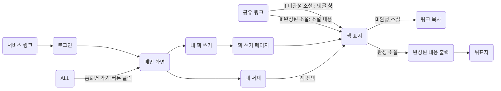

# 짱돌(함께 만드는 이야기)

### 배포 주소 : [짱돌](https://relay-story.site/)

<hr />

## ✨ 프로젝트 소개


```
짱돌(함께 만드는 이야기)은 사용자들이 함께 이야기를 만들어가는 서비스입니다.

사용자가 책 제목과 함께 첫 번째 이야기를 작성하고 주변 사람들에게 링크를 공유하면 공유받은 사용자들은 해당 링크를 통해 이야기를 이어서 작성합니다. 
사용자는 자신의 창작물에 대한 참여적인 느낌과 다른 사용자들과 이야기를 공유하는 즐거움을 느낄 수 있습니다. 
또한, 다른 사용자들이 자신이 작성한 이야기를 어떻게 이어나갈지 기대하는 재미도 느낄 수 있습니다.
```

<br />

### **☀️ 프로젝트 기간** 
2023.03.18 - 2023.04.17

<br />

### **🌤️ 사용 기술**

<table>
<thead>
  <tr>
    <th colspan="2">프론트엔드</th>
    <th colspan="2">백엔드</th>
    <th>디자인</th>
    <th>배포</th>
  </tr>
</thead>
<tbody align="center">
  <tr>
    <td></td>
    <td></td>
    <td></td>
    <td> </td>
    <td></td>
    <td><a href="https://www.figma.com/file/aT4DWL34pX2U3KIpPmfXlL/%EB%A6%B4%EB%A0%88%EC%9D%B4%EC%8A%A4%ED%86%A0%EB%A6%AC?node-id=0%3A1&t=5iJpLTtuHNII9yyt-1"></a> </td>
  </tr>
  <tr>
    <td><code>React</code></td>
    <td><code>styled-components</code></td>
    <td><code>python</code></td>
    <td><code>django</code></td>
    <td><code>Figma</code></td>
    <td><code>Netlify</code></td>
  </tr>
</tbody>
</table>

<br /><hr />

## ☁️ 팀 소개

|백엔드|백엔드|백엔드|프론트엔드|프론트엔드|
|:---:|:---:|:---:|:---:|:---:|
|||||  |
|[김나래](https://github.com/wing0529)|[김연우](https://github.com/yeonwoo8)|[최혁순](https://github.com/chs98412)|[김효리](https://github.com/hyoribogo)|[박다은](https://github.com/ekdms5566) |

<br /><br /><hr />

## 💫 화면 구성

<br />

[화면 설명](https://github.com/Likelion-Kwangwoon/team2-FE/wiki/%EC%A7%B1%EB%8F%8C(%ED%95%A8%EA%BB%98-%EB%A7%8C%EB%93%9C%EB%8A%94-%EC%9D%B4%EC%95%BC%EA%B8%B0))

| [로그인](https://github.com/Likelion-Kwangwoon/relay-story/wiki/%EC%A7%B1%EB%8F%8C(%ED%95%A8%EA%BB%98-%EB%A7%8C%EB%93%9C%EB%8A%94-%EC%9D%B4%EC%95%BC%EA%B8%B0)#-%EB%A1%9C%EA%B7%B8%EC%9D%B8) | [홈](https://github.com/Likelion-Kwangwoon/relay-story/wiki/%EC%A7%B1%EB%8F%8C(%ED%95%A8%EA%BB%98-%EB%A7%8C%EB%93%9C%EB%8A%94-%EC%9D%B4%EC%95%BC%EA%B8%B0)#-%ED%99%88) | 표지 선택 |
|:---:|:---:|:---:|
|| |  |
| [책 쓰기](https://github.com/Likelion-Kwangwoon/relay-story/wiki/%EC%A7%B1%EB%8F%8C(%ED%95%A8%EA%BB%98-%EB%A7%8C%EB%93%9C%EB%8A%94-%EC%9D%B4%EC%95%BC%EA%B8%B0)#-%EC%B1%85-%EC%93%B0%EA%B8%B0) | [미완성 책](https://github.com/Likelion-Kwangwoon/relay-story/wiki/%EC%A7%B1%EB%8F%8C(%ED%95%A8%EA%BB%98-%EB%A7%8C%EB%93%9C%EB%8A%94-%EC%9D%B4%EC%95%BC%EA%B8%B0)#-%EC%B1%85-%EC%84%B8%EB%B6%80-%ED%8E%98%EC%9D%B4%EC%A7%80) | [url 복사 및 공유](https://github.com/Likelion-Kwangwoon/relay-story/wiki/%EC%A7%B1%EB%8F%8C(%ED%95%A8%EA%BB%98-%EB%A7%8C%EB%93%9C%EB%8A%94-%EC%9D%B4%EC%95%BC%EA%B8%B0)#-url-%EA%B3%B5%EC%9C%A0-%EA%B8%B0%EB%8A%A5) |
|| |  |
| [댓글 작성](https://github.com/Likelion-Kwangwoon/relay-story/wiki/%EC%A7%B1%EB%8F%8C(%ED%95%A8%EA%BB%98-%EB%A7%8C%EB%93%9C%EB%8A%94-%EC%9D%B4%EC%95%BC%EA%B8%B0)#-%EB%A6%B4%EB%A0%88%EC%9D%B4-%EC%9E%91%EC%84%B1-%ED%8E%98%EC%9D%B4%EC%A7%80) | [내 서재](https://github.com/Likelion-Kwangwoon/relay-story/wiki/%EC%A7%B1%EB%8F%8C(%ED%95%A8%EA%BB%98-%EB%A7%8C%EB%93%9C%EB%8A%94-%EC%9D%B4%EC%95%BC%EA%B8%B0)#-%EB%82%B4-%EC%84%9C%EC%9E%AC) | [완성 책](https://github.com/Likelion-Kwangwoon/relay-story/wiki/%EC%A7%B1%EB%8F%8C(%ED%95%A8%EA%BB%98-%EB%A7%8C%EB%93%9C%EB%8A%94-%EC%9D%B4%EC%95%BC%EA%B8%B0)#-%EC%B1%85-%EC%84%B8%EB%B6%80-%ED%8E%98%EC%9D%B4%EC%A7%80) |
|| |  |
| [완성된 책 내용 확인](https://github.com/Likelion-Kwangwoon/relay-story/wiki/%EC%A7%B1%EB%8F%8C(%ED%95%A8%EA%BB%98-%EB%A7%8C%EB%93%9C%EB%8A%94-%EC%9D%B4%EC%95%BC%EA%B8%B0)#-%EC%B1%85-%EB%82%B4%EC%9A%A9-%ED%99%95%EC%9D%B8-%ED%8E%98%EC%9D%B4%EC%A7%80)| [책 표지 후면](https://github.com/Likelion-Kwangwoon/relay-story/wiki/%EC%A7%B1%EB%8F%8C(%ED%95%A8%EA%BB%98-%EB%A7%8C%EB%93%9C%EB%8A%94-%EC%9D%B4%EC%95%BC%EA%B8%B0)#-%EC%B1%85-%EC%84%B8%EB%B6%80-%ED%8E%98%EC%9D%B4%EC%A7%80) | [404 페이지](https://github.com/Likelion-Kwangwoon/relay-story/wiki/%EC%A7%B1%EB%8F%8C(%ED%95%A8%EA%BB%98-%EB%A7%8C%EB%93%9C%EB%8A%94-%EC%9D%B4%EC%95%BC%EA%B8%B0)#-404-%ED%8E%98%EC%9D%B4%EC%A7%80) |
|| |  |

<br /><hr />

## ❄️ 주요 기능

- 책 생성 기능
  - 책 표지 선택
  - 제목과 프롤로그 작성 후 '만들기' 버튼을 눌러 책 생성

- url 공유 기능
  - 해당 책 페이지 url을 공유
  - 책이 완성되었으면 표지 페이지로, 완성되지 않았다면 릴레이 작성 페이지로 이동
  
- 릴레이 작성 기능
  - 공유받은 링크로 들어올 경우, 링크를 공유한 사용자의 소설에 내용을 이어서 작성 가능
  - 이전에 작성한 사용자의 소설 내용 출력
 
 
<br /><hr />


## ⛄️ User Flow



<br />
<br /><hr />

### 💦 파일 구조  

```
📦public
 ├── _redirects
 ├── favicon.ico
 └── index.html
📦src
 ├── api : api 관련 정보 폴더
 │   └── api.js 
 ├── assets 
 ├── components 
 ├── layout 
 │   └── MainWrapper 
 ├── pages 
 ├── util 
 │   └── encrypt.js : 암호화/복호화 시 사용 
 ├── App.js
 ├── index.js
 └── theme.js : 공용 스타일 지정
📦package.json
📦README.md
```

<br />

### 🌟 시작 가이드

```
$ git clone https://github.com/Likelion-Kwangwoon/team2-FE
$ npm i
$ npm start
```